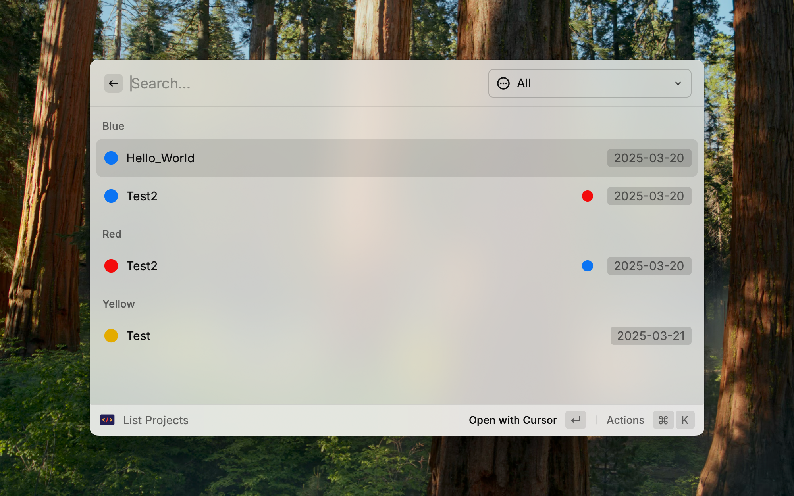

# Project Manager

This raycast extension helps you manage your projects. It allows you to create projects, list projects, and tag projects.

## Overview

### Create Project

You can specify the project name and the tags, along with the date.

The folder's name will be the project name with the date in the format `YYYY-MM-DD-project_name`.

The tags will be used to color the project in the list view, these tags will also appear in finder.

You can choose to open the project with your favorite code editor, terminal, or finder.

### List Projects

Projects are grouped by tag, you can filter the projects by tag.

Additional tags and date will be shown at the right side of the project name.

## Installation

1. Clone the repository
2. Run `npm install`
3. Run `npm run dev`
4. The extension will be available in raycast.

## Prerequisites

- Raycast
- `tag` command (`brew install tag`), which is used to set the tags to the project.

## Preferences

| Preference          | Description                                 |
| ------------------- | ------------------------------------------- |
| `Project Directory` | The directory to save the projects.         |
| `Tag Command`       | The command to set the tags to the project. |
| `Code Editor`       | The code editor to open the project.        |
| `Terminal`          | The terminal to open the project.           |
