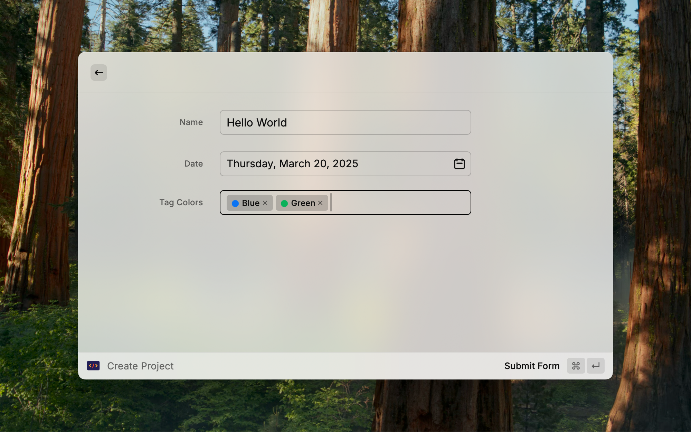
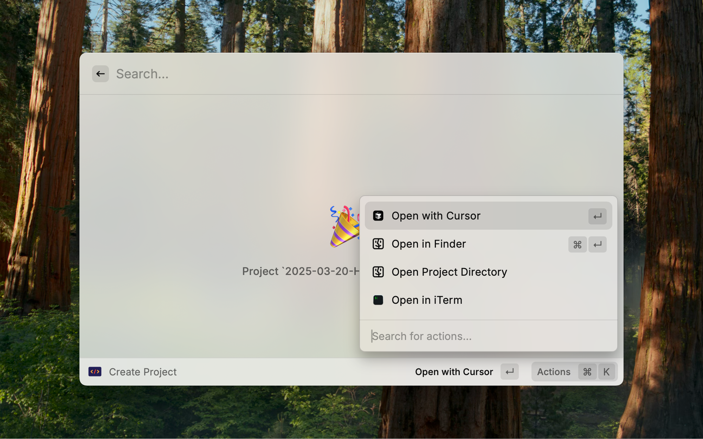
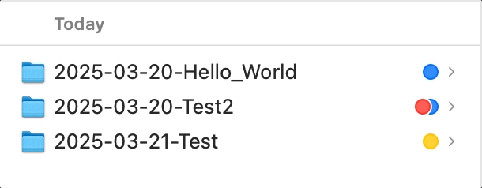

# Project Manager

这个 Raycast 扩展帮助你管理你的项目。它允许你创建项目、列出项目以及为项目添加标签。

## 概览

### 创建项目

你可以指定项目名称和标签，以及日期。
文件夹的名称将是项目名称加上日期，格式为 `YYYY-MM-DD-project_name`。
标签将用于在列表视图中为项目着色，这些标签也会在 Finder 中显示。

你可以选择使用你喜欢的代码编辑器、终端或 Finder 打开项目。

项目将创建在项目目录中。

### 列出项目

项目按标签分组，你可以按标签过滤项目。
额外的标签和日期将显示在项目名称的右侧。

## 安装

1. 克隆仓库
2. 运行 `npm install`
3. 运行 `npm run dev`
4. 扩展将在 Raycast 中可用。

## 依赖

- Raycast
- `tag` 命令 (`brew install tag`)，用于为项目设置标签。

## 偏好设置

| 偏好设置     | 描述                   |
| ------------ | ---------------------- |
| `项目目录`   | 保存项目的目录。       |
| `标签命令`   | 为项目设置标签的命令。 |
| `代码编辑器` | 打开项目的代码编辑器。 |
| `终端`       | 打开项目的终端。       |
